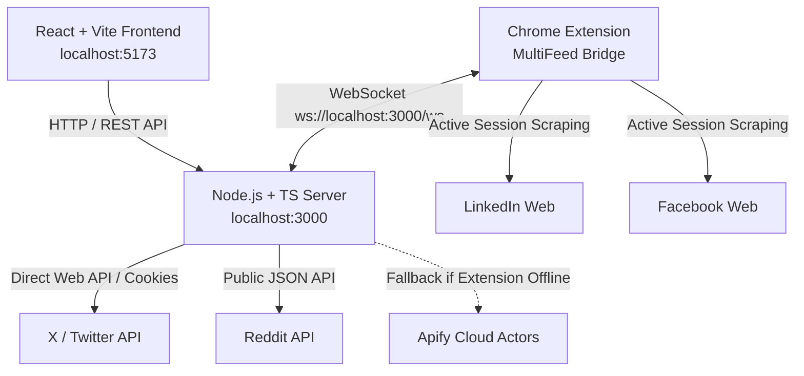

# 🌐 MultiFeed Search & Lead Intelligence Platform

A unified, real-time cross-platform intelligence and lead scraping application. Search topics, monitor hashtags, extract contact leads (emails and phone numbers), and scrape live data across **X (Twitter)**, **Reddit**, **LinkedIn**, and **Facebook** simultaneously with **$0.00 free scraping** support via Chrome Extension.

---

## 📑 Table of Contents

- [Features](#-features)
- [Architecture Overview](#-architecture-overview)
- [Prerequisites](#-prerequisites)
- [Installation & Quick Start](#-installation--quick-start)
- [Configuration & Credentials](#-configuration--credentials)
  - [1. X (Twitter) Session Setup](#1-x-twitter-session-setup)
  - [2. Chrome Extension Setup ($0.00 Free Scraping)](#2-chrome-extension-setup-000-free-scraping)
  - [3. Apify Cloud Fallback (Optional)](#3-apify-cloud-fallback-optional)
- [How to Use the Application](#-how-to-use-the-application)
  - [Performing Searches](#performing-searches)
  - [Multi-Keyword Searching](#multi-keyword-searching)
  - [Platform Toggles & Quick Scraping](#platform-toggles--quick-scraping)
  - [Lead Extraction & 1-Click Copy](#lead-extraction--1-click-copy)
  - [Auto-Refresh & Live Feed Monitoring](#auto-refresh--live-feed-monitoring)
  - [Status & Balance Monitoring](#status--balance-monitoring)
- [API Endpoints Reference](#-api-endpoints-reference)
- [Troubleshooting & FAQs](#-troubleshooting--faqs)

---

## ✨ Features

- **Multi-Platform Search in One Feed**: Aggregates real-time posts from **X (Twitter)**, **Reddit**, **LinkedIn**, and **Facebook**.
- **Automated Lead & Contact Extraction**: Instantly parses and validates email addresses (`user@domain.com`) and phone numbers directly from post texts, author names, and profile bios.
- **1-Click Bulk Lead Export**: Copy all extracted emails or phone numbers to your clipboard in a single click.
- **$0.00 Free Scraping via Chrome Extension**: Connects the backend to your active Chrome browser session via WebSockets to scrape LinkedIn and Facebook without paid API costs or captcha blockers.
- **Smart Cloud Fallback**: Automatically falls back to Apify actors if the Chrome extension is offline, complete with real-time balance tracking.
- **Live Feed Auto-Refresh**: Set auto-refresh intervals (30s, 1m, 2m, 5m) for real-time monitoring of breaking news or lead discovery.
- **Multi-Query Support**: Comma-separate queries (e.g. `React Native, Flutter, @gmail.com`) to query multiple topics in a single request.
- **Persistent State**: Automatically remembers your last search query and active platform filters via browser `localStorage`.

---

## 🏗️ Architecture Overview



---

## 📋 Prerequisites

- **Node.js** v18.0.0 or higher
- **npm** or **yarn** / **pnpm**
- **Google Chrome** (for the free Scraping Extension)
- Active accounts on **X.com**, **LinkedIn**, and **Facebook** (if scraping authenticated feeds)

---

## 🚀 Installation & Quick Start

### 1. Clone & Install Root Dependencies
```bash
# In the project root directory
npm install
```

### 2. Install Client Dependencies
```bash
cd client
npm install
cd ..
```

### 3. Configure Environment Variables
Copy the example environment file:
```bash
cp .env.example .env
```
Edit `.env` with your tokens (see [Configuration & Credentials](#-configuration--credentials)).

### 4. Start the Application

You can run both backend and frontend development servers:

**Terminal 1 (Backend API & WebSocket Server):**
```bash
npm run dev
# Server runs on http://localhost:3000
```

**Terminal 2 (Frontend React App):**
```bash
cd client
npm run dev
# Frontend runs on http://localhost:5173
```

Open your browser at **`http://localhost:5173`**.

---

## ⚙️ Configuration & Credentials

### 1. X (Twitter) Session Setup
To enable X search, extract your session cookies from your logged-in browser session at [x.com](https://x.com):

1. Open [x.com](https://x.com) in Google Chrome and log into your account.
2. Press `F12` or `Cmd + Option + I` to open Chrome DevTools.
3. Go to the **Application** tab -> **Cookies** -> `https://x.com`.
4. Copy the following cookie values into your `.env` file:
   - `auth_token` ➔ `X_AUTH_TOKEN`
   - `ct0` ➔ `X_CT0`
   - `guest_id` ➔ `X_GUEST_TOKEN` (optional)

Example `.env`:
```env
PORT=3000
X_AUTH_TOKEN=7c9...
X_CT0=98b...
X_BEARER_TOKEN=AAAAAAAAAAAAAAAAAAAAANRILgAAAAAAnNwIzUejRCOuH5E6I8xnZz4puTs%3D1Zv7ttfk8LF81IUq16cHjhLTvJu4FA33AGWWjCpTnA
X_SEARCH_TIMELINE_QUERY_ID=hyPfJYJ_XAtDYoslQc-Rgg
```

---

### 2. Chrome Extension Setup ($0.00 Free Scraping)

The Chrome extension connects directly to your active browser session, giving you free, unlimited LinkedIn and Facebook searches without Apify fees.

1. Open Google Chrome and navigate to `chrome://extensions/`.
2. Enable **Developer mode** toggle in the top-right corner.
3. Click **Load unpacked** in the top-left corner.
4. Select the `extension/` folder in this repository.
5. Ensure your backend server is running (`npm run dev`).
6. Click the extension icon in Chrome's toolbar. You should see a green **Connected** status indicator.
7. In the Web UI, the status pill in the header will turn to **`Extension: $0.00 Active`**.

---

### 3. Apify Cloud Fallback (Optional)

If the Chrome extension is offline or disabled, the server can use Apify Cloud Actors as a fallback.

1. Sign up at [Apify.com](https://apify.com).
2. Get your API Token from **Settings ➔ Integrations ➔ API Tokens**.
3. Add your token(s) to `.env`:
```env
APIFY_TOKEN=apify_api_xxxxx
APIFY_TOKEN2=apify_api_yyyyy   # Optional fallback token
APIFY_TOKEN3=apify_api_zzzzz   # Optional fallback token
```
4. The web dashboard will automatically display your remaining Apify balance and usage in real time.

---

## 📖 How to Use the Application

### Performing Searches
1. Enter your search query into the search bar (e.g. `React Developer`, `AI Agents`, `#crypto`).
2. Click **Search All** or press `Enter`.
3. The app will fetch results across all active sources and display them in a unified, chronological grid.

### Multi-Keyword Searching
You can search multiple queries at once by separating keywords with commas:
```text
React Native, Flutter, Senior iOS Engineer
```
The app will concurrently search for all terms and aggregate the results.

### Platform Toggles & Quick Scraping
- **Source Toggles**: Click the platform pills (**X**, **Reddit**, **LinkedIn**, **Facebook**) to filter items in real time.
- **+ LinkedIn ($0.00)**: Instantly triggers an on-demand LinkedIn search for the current query.
- **+ Facebook ($0.00)**: Instantly triggers an on-demand Facebook search for the current query.
- **Select / Deselect All**: Toggle all source platforms with a single click.

### Lead Extraction & 1-Click Copy
The app scans every post for contact details using regex filters:
- **Lead Filter Pills**:
  - `All (count)`: Shows all matching posts.
  - `⚡ Any Lead (count)`: Shows only posts containing either an email or phone number.
  - `✉️ With Email (count)`: Filters for posts with verified email addresses.
  - `📞 With Phone (count)`: Filters for posts with phone numbers.
- **Bulk Copy Buttons**:
  - Click **`Copy N Emails`** in the results header to copy all extracted email addresses formatted on new lines.
  - Click **`Copy N Phones`** to copy all phone numbers.
- **Individual Contact Badges**:
  - Each post displays clickable email/phone badges. Click any badge to copy that specific contact.

### Auto-Refresh & Live Feed Monitoring
- Use the **Auto:** dropdown in the header to set automated background polling:
  - **Options**: `Off`, `30s`, `1m`, `2m`, `5m`.
  - Displays a live pulsing dot and a relative time counter (e.g., `Updated 15s ago`).
- Click **Refresh** at any time to pull new items manually.

### Status & Balance Monitoring
- **Extension Pill**: Shows whether the WebSocket bridge is connected (`$0.00 Active`) or `Offline`.
- **Sync Status Button**: Re-verifies extension connection and pulls updated Apify quotas.
- **Apify Balance Dropdown**: Displays remaining USD credits, usage percentages, and individual token limits.

---

## 📡 API Endpoints Reference

| Method | Endpoint | Query Parameters | Description |
|---|---|---|---|
| `GET` | `/api/feed` | `q` (string), `count` (number), `xCursor`, `redditAfter` | Combined search for X (Twitter) and Reddit. |
| `GET` | `/api/linkedin` | `q` (string), `count` (number) | Searches LinkedIn via Extension ($0.00) or Apify. |
| `GET` | `/api/facebook` | `q` (string), `count` (number) | Searches Facebook via Extension ($0.00) or Apify. |
| `GET` | `/api/apify/balance` | None | Returns credit balances for all configured Apify tokens. |
| `GET` | `/api/extension/status` | None | Returns active Chrome Extension WebSocket connection status. |

---

## ❓ Troubleshooting & FAQs

### 1. Why does LinkedIn or Facebook return an error or take long?
- **Check Extension Status**: Ensure the MultiFeed Chrome Extension is loaded and showing `Connected`.
- **Logged-in Session**: Make sure you are logged into your LinkedIn/Facebook account in the same Chrome profile.
- **Apify Fallback**: If using Apify, check if your token balance is exhausted in the top-right header balance pill.

### 2. Why are X (Twitter) search results empty or failing?
- Twitter requires session tokens (`auth_token` and `ct0`).
- Check if your cookies expired on `x.com`. Refresh `x.com` in Chrome DevTools and update `X_AUTH_TOKEN` and `X_CT0` in `.env`.

### 3. How do I change the backend port?
- Change `PORT=3000` in `.env` to your preferred port (e.g. `PORT=8080`).
- Note: In development mode, update `client/vite.config.ts` proxy target if you change the backend port.

---

## 📄 License
Private project. All rights reserved.
